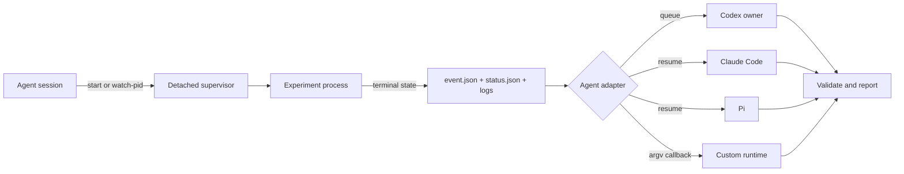

# Agent Trigger

A coding-agent skill for running long experiments without blocking the active conversation, then returning to the original agent session when the process finishes. It works with Codex, Claude Code, Pi, and custom agent runtimes through a shared event contract and host-specific callback adapters.

## What This Does

Long-running commands create an awkward gap in agent workflows. The agent can launch an experiment, but if it waits with `sleep` or repeatedly polls the process, the current turn stays occupied. If it returns immediately, nothing naturally brings it back to inspect the results.

**Agent Trigger** closes that gap:

1. It launches a command under a detached supervisor, or attaches to an existing PID.
2. The supervisor waits outside the active agent turn.
3. On process exit, it records a durable terminal event and preserves the logs.
4. An agent-specific adapter sends a follow-up prompt to the original session.
5. The resumed agent validates the artifacts and continues the promised analysis.

The active agent does not need to stay alive with `sleep`, a shell polling loop, or repeated status checks.

### Key Features

- **Non-blocking** — The launcher returns immediately while a detached supervisor owns the wait.
- **Event-driven waiting** — New child processes use `waitpid`; existing PIDs use kqueue on macOS, pidfd on Linux, and process handles on Windows when available.
- **Durable state** — Status, terminal events, stdout, stderr, and callback logs survive outside the conversation transcript.
- **Original-session return** — Codex queues to the session owner; Claude Code and Pi resume through their own session interfaces.
- **Portable adapter contract** — Other agents can provide a JSON callback without changing the process monitor.
- **Fail-closed setup** — `doctor` verifies that a real return path exists before an experiment starts.
- **Zero runtime dependencies** — The supervisor uses only the Python standard library.
- **Evidence-first reporting** — Completion wakes the agent, but logs and artifacts still have to be validated before success is reported.

## Installation

Clone the repository:

```bash
git clone https://github.com/YuAnReL/Trigger-skills.git
cd Trigger-skills
```

### Codex

Install the skill in the shared Agent Skills directory:

```bash
mkdir -p ~/.agents/skills
cp -R agent-trigger ~/.agents/skills/agent-trigger
```

You can also symlink the folder while developing:

```bash
ln -s "$(pwd)/agent-trigger" ~/.agents/skills/agent-trigger
```

Then ask Codex to use `$agent-trigger` when a long-running command should return to the same task after completion.

### Claude Code

```bash
mkdir -p ~/.claude/skills
cp -R agent-trigger ~/.claude/skills/agent-trigger
```

Invoke the skill as `/agent-trigger`, or ask Claude Code to use the Agent Trigger skill. The Claude adapter requires the session ID to be passed explicitly unless the host exposes one to the agent.

### Pi

```bash
mkdir -p ~/.pi/agent/skills
cp -R agent-trigger ~/.pi/agent/skills/agent-trigger
```

Pi can also discover the skill from `~/.agents/skills/agent-trigger`.

### Other Coding Agents

Any local agent that can read [`SKILL.md`](agent-trigger/SKILL.md), run Python, and expose a resumable session or callback command can use the same supervisor.

Point the agent at this repository and ask it to start from:

```text
agent-trigger/SKILL.md
```

For an unsupported runtime, configure a generic callback instead of adding agent-specific logic to the monitor.

## Usage

### Ask the Agent Naturally

```text
$agent-trigger

Run `python3 train.py --config configs/experiment.yaml` in the background.
When it finishes, come back to this conversation, validate the output artifacts,
and summarize the results. Do not block this turn with sleep or polling.
```

The agent should run `doctor`, register the detached supervisor, verify the initial status once, and return control to you. Completion later appears as a follow-up in the original session.

### Start a New Command Directly

```bash
python3 agent-trigger/scripts/agent_trigger.py doctor --agent auto

python3 agent-trigger/scripts/agent_trigger.py start \
  --name training-run \
  --agent auto \
  --cwd /absolute/path/to/project \
  --resume-prompt 'Read {event_file}, validate the run artifacts, and report the results.' \
  -- \
  python3 train.py --config configs/experiment.yaml
```

Everything after `--` is passed as an argv array without an implicit shell.

### Attach to an Existing Process

```bash
python3 agent-trigger/scripts/agent_trigger.py watch-pid \
  --name existing-training-run \
  --agent codex \
  --session-id SESSION_ID \
  --cwd /absolute/path/to/project \
  12345
```

An attached watcher can prove that the PID exited, but it cannot recover the process exit code. The resumed agent must use the experiment's own logs or artifacts to determine whether the run succeeded.

### Inspect a Job

```bash
python3 agent-trigger/scripts/agent_trigger.py status JOB_ID
python3 agent-trigger/scripts/agent_trigger.py list
```

By default, jobs are stored under `~/.agent-trigger/jobs`. Override the root with `--state-dir` or `AGENT_TRIGGER_HOME`.

## Agent Adapters

The monitor is shared. Only the return transport changes between agent runtimes.

| Runtime | Callback | Session discovery |
| --- | --- | --- |
| Codex | `codex queue --thread <id> --message <prompt>` | Automatic from `CODEX_THREAD_ID` or `CODEX_SESSION_ID`, or explicit |
| Claude Code | `claude -p --resume <id> <prompt>` | Explicit session ID |
| Pi | `pi -p --session <id> <prompt>` | Explicit session ID or session file |
| Custom agent | User-provided argv callback | Defined by the host integration |

Codex intentionally uses `queue`, not `codex exec resume`. A live Desktop or TUI session already has an owning writer; starting another client against the same history can fail with an `active writer` conflict. `queue` delivers the follow-up to the owner instead.

See [`agent-adapters.md`](agent-trigger/references/agent-adapters.md) for adapter details and source references.

## Custom Callback

Create a JSON callback configuration:

```json
{
  "argv": ["my-agent-resume", "--session", "abc123", "--event", "{event_file}"],
  "stdin": "{message}",
  "cwd": "{cwd}",
  "timeout_seconds": 7200
}
```

Then launch with:

```bash
python3 agent-trigger/scripts/agent_trigger.py start \
  --callback-config /absolute/path/callback.json \
  --cwd /absolute/path/to/project \
  -- \
  python3 long_running_job.py
```

Available placeholders include `{job_id}`, `{phase}`, `{exit_code}`, `{job_dir}`, `{event_file}`, `{status_file}`, `{stdout_log}`, `{stderr_log}`, `{cwd}`, and `{message}`. They are also exported as `AGENT_TRIGGER_<NAME>` environment variables.

## Architecture



Each job directory contains:

- `spec.json` — immutable launch and callback configuration
- `status.json` — latest atomic status snapshot
- `event.json` — durable terminal event
- `stdout.log` and `stderr.log` — experiment output
- `callback.stdout.log` and `callback.stderr.log` — callback delivery output
- `monitor.log` — detached supervisor diagnostics

The experiment phase and callback status are intentionally separate. A run may finish successfully even if delivery back to the agent fails; the event remains available for recovery.

## Requirements

- Python 3.9 or newer
- A local agent runtime with a resumable session, or a custom callback command
- For Codex: a `codex` executable that provides the `queue` command
- For Claude Code or Pi: the corresponding CLI when using the built-in adapter

The machine must remain running while the experiment and detached supervisor are active.

## Testing

Run the unit and integration tests:

```bash
python3 agent-trigger/scripts/test_agent_trigger.py
```

Validate the skill package with Codex's `skill-creator` validator when available:

```bash
python3 /path/to/skill-creator/scripts/quick_validate.py agent-trigger
```

## Safety Notes

- Callback commands run with the authenticated state and permissions of the selected agent runtime.
- Never put API keys, bearer tokens, or other secrets in callback argv or `spec.json`.
- Use an explicit shell command only when a pipeline is truly required; experiment argv is shell-free by default.
- Use one callback per job unless deliberate fan-out is required.
- A zero exit code is not sufficient evidence that expected artifacts are complete or valid.

## Project Structure

```text
agent-trigger/
├── SKILL.md
├── agents/
│   └── openai.yaml
├── references/
│   └── agent-adapters.md
└── scripts/
    ├── agent_trigger.py
    └── test_agent_trigger.py
```
